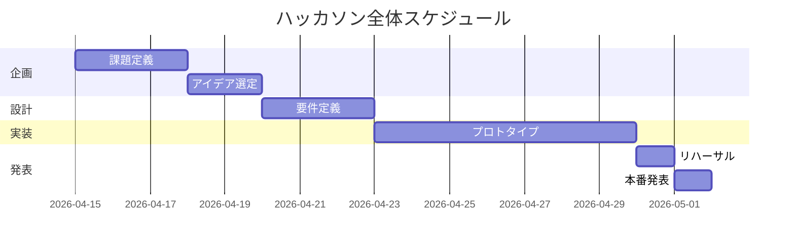

# スケジュール

## 全体スケジュール
| フェーズ | 開始 | 終了 | 担当 | 状態 |
|---------|------|------|------|------|
| 企画 | | | | 未着手/進行中/完了 |
| 設計 | | | | |
| 実装 | | | | |
| テスト | | | | |
| 発表準備 | | | | |

## ガントチャート（Mermaid）

