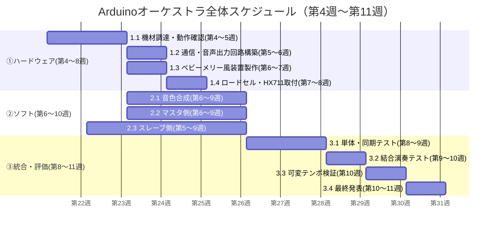

# スケジュール

Arduinoオーケストラ（きらきら星 輪唱演奏システム）の作業スケジュールを示す。スケジュールは「週」単位（第4週〜第11週）で管理する。WBSの詳細は [計画書・設計書](../01-integration/計画書・設計書.tex)「作業計画」を参照。

## 全体スケジュール
| フェーズ | 開始 | 終了 | 担当 | 状態 |
|---------|------|------|------|------|
| ①ハードウェアフェーズ | 第4週 | 第8週 | 全員 | 未着手 |
| ②ソフトウェアフェーズ | 第6週 | 第10週 | 2年生中心（佐藤／成毛／山口） | 未着手 |
| ③統合・評価フェーズ | 第8週 | 第11週 | 全員 | 未着手 |

状態は「未着手／進行中／完了」で管理する。

## ガントチャート（Mermaid）

週番号ベースで簡潔に記述する。Mermaidの`dateFormat`では「週」を直接表現しづらいため、第4週を起点（基準日 2026-05-25 を仮の第4週開始日とする）として相対的に各タスクを配置し、タスク名に「第N週」を併記する。

```mermaid
gantt
    title Arduinoオーケストラ全体スケジュール（第4週〜第11週）
    dateFormat  YYYY-MM-DD
    axisFormat  第%U週

    section ①ハードウェア(第4〜8週)
    1.1 機材調達・動作確認(第4〜5週)   :h1, 2026-05-25, 14d
    1.2 通信・音声出力回路構築(第5〜6週) :h2, after h1, 7d
    1.3 ベビーメリー風装置製作(第6〜7週) :h3, 2026-06-08, 7d
    1.4 ロードセル・HX711取付(第7〜8週)  :h4, 2026-06-15, 7d

    section ②ソフト(第6〜10週)
    2.1 音色合成(第6〜9週)            :s1, 2026-06-08, 21d
    2.2 マスタ側(第6〜9週)            :s2, 2026-06-08, 21d
    2.3 スレーブ側(第5〜9週)          :s3, 2026-06-01, 28d

    section ③統合・評価(第8〜11週)
    3.1 単体・同期テスト(第8〜9週)     :i1, after s3, 14d
    3.2 結合演奏テスト(第9〜10週)      :i2, after i1, 7d
    3.3 可変テンポ検証(第10週)        :i3, after i2, 7d
    3.4 最終発表(第10〜11週)          :i4, after i3, 7d
```

主要WBSの対応は次のとおり。

- **1.1 機材調達**（第4〜5週・全員）
- **1.2 回路構築**（第5〜6週・全員）
- **2.1 音色合成**（第6〜9週・佐藤／成毛／山口）
- **2.2 マスタ側**（第6〜9週・成毛／佐藤／山口）
- **2.3 スレーブ側**（第5〜9週・成毛／佐藤／山口）
- **3.1 単体・同期テスト**（第8〜9週・全員）
- **3.2 結合演奏テスト**（第9〜10週・全員）
- **3.3 可変テンポ検証**（第10週・全員）
- **3.4 最終発表**（第10〜11週・全員）

## クリティカルパス

本プロジェクトのクリティカルパスは

**1.1 → 1.2 → 2.3 → 2.3.1 → 2.3.2 → 2.3.3 → 2.3.4 → 3.1 → 3.2 → 3.3 → 3.4**

であり、総工数は**約87時間**である。このパス上のタスクが遅延すると全体スケジュールが直接影響を受けるため、特にスレーブ側のソフトウェア実装（2.3〜2.3.4、計53時間）を優先的に進める必要がある。

| WBS | 作業名 | 工数 | 期間 |
|-----|--------|------|------|
| 1.1 | 機材調達・Arduino動作確認 | 5h | 第4〜5週 |
| 1.2 | 通信回路・音声出力回路構築 | 2h | 第5〜6週 |
| 2.3 | 共通ライブラリ整備 | 10h | 第5〜6週 |
| 2.3.1 | ISR受信・デコード処理 | 15h | 第6〜8週 |
| 2.3.2 | PLL同期アルゴリズム実装 | 10h | 第7〜9週 |
| 2.3.3 | 音符スケジューリング | 6h | 第7〜9週 |
| 2.3.4 | 輪唱位置管理 | 12h | 第7〜9週 |
| 3.1 | 単体・同期精度テスト | 8h | 第8〜9週 |
| 3.2 | 全体結合演奏テスト | 10h | 第9〜10週 |
| 3.3 | 可変テンポ動作検証 | 9h | 第10週 |
| 3.4 | 最終発表・報告 | — | 第10〜11週 |

合計工数（全員・個人タスク含む）は約206hである。
